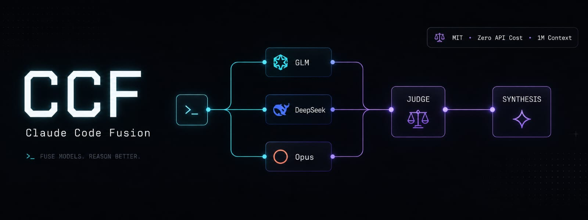

<p align="center">
  
</p>

<h1 align="center">CCF — Claude Code Fusion</h1>

<p align="center">
  <a href="https://github.com/brahmsyaifullah/CCF/releases"></a>
  
  
  
  <a href="benchmark/RESULTS.md"></a>
</p>

Run a **multi-model fusion panel** inside Claude Code, on your **own subscription/flat-rate seats** —
no OpenRouter billing. A panel of models (GLM-5.2 1M, DeepSeek-V4-Pro 1M, optionally Sonnet/Opus,
GPT-5.5 Codex) answers a task **in parallel**; your running **Opus session judges** their drafts into
structured analysis (consensus / contradictions / unique insight / blind spots) and writes the final answer.

It's a local re-implementation of OpenRouter's "Fusion" pattern that bills nothing extra because the
panelists run on seats you already pay for.

```
            ┌── glm-5.2  (z.ai, 1M ctx) ──┐
your task ──┤                              ├──►  Opus judge ──►  synthesized answer
            └── deepseek-v4-pro (1M ctx) ──┘     (this session)
```

## Why

- **Diversity beats a single model.** A second/third independent draft catches blind spots.
- **No metered API.** Panelists run on z.ai / OpenCode subscriptions and your Claude sub.
- **Huge context.** Both default panelists carry **~1,048,576-token** windows (verified by
  needle-in-haystack — see [Context limits](#context-limits)).
- **Opus stays the author.** Panelists never write files; the orchestrator applies the code.

## Does it actually help?

<p align="center">
  
</p>

We ran a controlled **Solo vs Fusion** benchmark — 5 real engineering tasks (bug fix, security,
refactor, architecture, concurrency), the same Opus orchestrator as both the solo answerer and the
fusion judge. **Fusion scored 196 vs Solo 192 / 200.** A real but honest lift: with a top-tier solo
model the panel mostly **verifies and insures against single-model blind spots** (one task: glm 5/5
spots, deepseek 3/5, gpt 4/5 — the synthesis caught what the weakest missed). The run also caught a
real usability bug in our own panel. Full methodology, scores, and bias disclosure:
**[benchmark/RESULTS.md](benchmark/RESULTS.md)**.

## Requirements

- [Claude Code](https://claude.com/claude-code)
- `bash`, `jq`, `curl`, `awk`, `tar` (preinstalled on macOS/Linux except `jq`)
- A POSIX shell on Windows: **Git for Windows** (native) or **WSL**
- At least one provider key (z.ai and/or OpenCode). The Sonnet/Opus panelists use your `claude` CLI.
- For the optional Codex (GPT-5.5) panelist: `python3` (stdlib only, used only for the one-time browser login).

## Codex / GPT-5.5 panelist (optional)

Add OpenAI's Codex (GPT-5.5) as a panelist on your **ChatGPT/Codex subscription** — **no codex CLI
required**. Log in through your browser:

```bash
~/.claude/fusion/ccf-codex-login          # opens ChatGPT OAuth, stores tokens (chmod 600)
~/.claude/fusion/ccf-codex-login --no-browser   # headless/SSH: prints the URL
```

This runs the same OAuth 2.0 + PKCE flow the codex CLI uses, writes `~/.codex/auth.json`, and
`fusion-call` auto-refreshes the token when it nears expiry. Then enable it:

```bash
# add the gpt panelist (provider codex / model gpt-5.5) if not already present, then:
/fusion-config enable gpt
/fusion-status            # gpt should probe OK
```

## Install

**macOS / Linux / WSL**

```bash
curl -fsSL https://raw.githubusercontent.com/brahmsyaifullah/CCF/main/install.sh | bash
```

**Windows (native PowerShell — needs Git Bash or WSL)**

```powershell
irm https://raw.githubusercontent.com/brahmsyaifullah/CCF/main/install.ps1 | iex
```

Or clone and run locally:

```bash
git clone https://github.com/brahmsyaifullah/CCF && cd CCF && ./install.sh
```

The installer copies the dispatcher, hooks, and slash commands into `~/.claude`, creates a
`secrets.env` (chmod 600) for your keys, and idempotently wires two hooks into `settings.json`
(backed up first). It **never** overwrites an existing `secrets.env`, `panel.json`, or `providers.json`.

Then:

1. Add keys — edit `~/.claude/fusion/secrets.env` or run `/fusion-config set-key`.
2. **Restart Claude Code** (hooks + commands load at launch).
3. `/fusion-status` to verify, then `/fusion <task>`.

## Usage

| Command | What it does |
|---------|--------------|
| `/fusion-onboard` | Guided setup — pick providers, add keys (validated), enable panelists. |
| `/fusion <task>` | Run a panel → judge → synthesis pass on demand (works anytime). |
| `/fusion-on` · `/fusion-off` | Toggle default-mode (proactive routing of substantial tasks). |
| `/fusion-status` | Show roster, providers, context limits, key presence, reachability. |
| `/fusion-config` | Add/edit providers, set/rotate keys, enable/disable panelists. |
| `/fusion-analytics` | Text dashboard: run stats, latency, success rate, cost saved vs OpenRouter. |
| `/fusion-benchmark` | Run SOLO vs FUSION on 5 coding tasks. Sequential, outputs markdown. |
| `/fusion-benchmark-report` | Generate comparison REPORT.md from benchmark results. |
| `/ccf-update` | Update CCF from GitHub (preserves your keys + config). |

Default-mode ships **off** — `/fusion` is always available explicitly.

## Onboarding

After install, run the guided setup in your terminal (keys are read hidden, never pasted into chat):

```bash
~/.claude/fusion/fusion-onboard           # interactive
~/.claude/fusion/fusion-onboard --dry-run # preview, writes nothing
```

It lists the provider catalog, takes a key, **validates it with a live probe**, registers the
provider, and enables a recommended model as a panelist — idempotent, every write backed up. Inside
Claude Code, `/fusion-onboard` points you to it.

## Providers & panelists

Default roster (`panel.json`):

- **Judge / writer:** Opus (your Claude session) — never demoted.
- **Panel (enabled):** `glm` (z.ai GLM-5.2) · `deepseek` (OpenCode-Go DeepSeek-V4-Pro).
- **Available (disabled):** `sonnet`, `opus` (your sub via `claude` CLI), `deepseek-flash`,
  `north-code` (free, non-zero-retention), `gpt` (Codex GPT-5.5 via your OpenAI subscription).

### Provider catalog

CCF ships a catalog (`~/.claude/fusion/catalog.json`) of **21 providers** with correct
OpenAI/Anthropic-compatible endpoints, recommended current models, and docs links — **disabled by
default**, so you enable only what you have keys for:

OpenAI · Anthropic · Google Gemini · DeepSeek · xAI Grok · Mistral · Moonshot · Kimi-Code ·
MiniMax · Groq · Cerebras · Qwen · OpenRouter · Together · Fireworks · Novita · HuggingFace ·
Xiaomi MiMo · Ollama (cloud) · **Ollama (local — keyless, air-gapped, zero-retention)** ·
**Codex (OpenAI subscription — GPT-5.5 via your own Codex CLI auth)**.

Enable one via `/fusion-onboard`, or `/fusion-config add-provider --from-catalog <name>`. The
catalog is read-only reference (refreshed on update); your live `providers.json` is never touched by it.
Keyless/self-hosted endpoints (Ollama local) need no key — ideal for sensitive code.

**The complete registry** lives at [models.dev](https://models.dev) — **121+ providers, every model**
with context + cost. The curated catalog is a starter subset; for the full list use `ccf-models`:

```bash
~/.claude/fusion/ccf-models providers            # list all 121+ providers
~/.claude/fusion/ccf-models models <provider>    # a provider's models (context, $/Mtok)
~/.claude/fusion/ccf-models add <provider> <model> [panelist]   # register + add panelist
```

### Panelist system prompt

Every panelist inherits `panel.json`'s `default_system_prompt` (role + output contract: answer
directly, propose-don't-act, flag risks with severity). Override one with a per-panelist
`system_prompt`, or set the default to `""` to disable. `fusion-call` injects it correctly per
transport (openai system message / anthropic top-level `system`).

## Context limits

Verified 2026-06-16 by needle-in-haystack (needle retrieved at 90% depth in a full ~1M-token prompt):

| Panelist | Provider | Ceiling | tok/char | Usable prompt |
|----------|----------|---------|----------|---------------|
| `glm` | z.ai GLM-5.2 | 1,048,576 tok | ~0.264 | ≤ ~3.9M chars |
| `deepseek` | OpenCode-Go DeepSeek-V4-Pro | 1,048,565 tok | ~0.295 | ≤ ~3.55M chars |
| `sonnet`/`opus` | claude sub | ~200K tok | ~0.25 | ≤ ~760K chars |
| `gpt` | Codex GPT-5.5 | ~200K tok | ~0.25 | ≤ ~760K chars |

The dispatcher rejects oversize prompts **before** upload (with the exact char budget) instead of
letting the API return a silent empty response. Large 1M calls take ~40–60s.

### Web search (optional)

Set `TAVILY_API_KEY` in `secrets.env` to let panelists search the web during a task. Add `--search`
when calling a panelist:

```bash
~/.claude/fusion/fusion-call --search deepseek "What changed in the latest React release?"
```

Panelists use standard function calling to request searches; CCF calls Tavily locally and feeds
results back (up to 3 rounds). Currently supported on the `openai` transport (DeepSeek). Get a key
at [tavily.com](https://tavily.com).

## Security

- **No keys in this repo.** `secrets.env` is gitignored; only `secrets.env.example` is tracked.
- Keys live in `~/.claude/fusion/secrets.env` (chmod 600), referenced by `key_env` name only.
- **Zero-retention gating.** Free/pay-per-token providers are flagged `zero_retention=false`; the
  `/fusion` sensitivity gate refuses to send proprietary/customer code to any panelist marked
  `sensitive_ok=false`. Check `/fusion-status` — non-zero-retention providers show `FALSE!`.
- Rotate a key anytime with `/fusion-config set-key`.

## Updating

Notify-only by default: a throttled (~daily), fail-silent `SessionStart` hook checks GitHub and, if
a newer version exists, prints `[CCF] update available …`. Apply with:

```bash
/ccf-update            # or: bash ~/.claude/fusion/ccf-update.sh
~/.claude/fusion/ccf-update.sh --check    # report only
~/.claude/fusion/ccf-update.sh --force    # reinstall latest
```

Updates refresh **code only** (dispatcher, hooks, commands, `.dist` templates). Your `secrets.env`,
`panel.json`, and `providers.json` are preserved; new reference fields are reported for manual merge.
Skip the notifier at install with `--no-update-hook`.

## Uninstall

```bash
rm -rf ~/.claude/fusion ~/.claude/commands/fusion*.md ~/.claude/commands/ccf-update.md
# then remove the two CCF hook entries from ~/.claude/settings.json
# (a timestamped settings.json.ccf-bak.* backup was made at install)
```

## How it works

| File (installed under `~/.claude/`) | Role |
|------|------|
| `fusion/fusion-call` | Dispatcher. openai / anthropic / claude-cli transports. File-based body (1M-token safe past ARG_MAX), per-provider timeout, oversize-context guard, clear `ERR:` reporting. |
| `fusion/providers.json` | Transport registry: endpoint, auth, `key_env`, `max_tokens`, `request_timeout`, `max_context_tokens`, `tok_per_char`, `zero_retention`. |
| `fusion/panel.json` | Roster + `active` flag. `enabled` panelists form the default panel; `sensitive_ok` gates proprietary code. |
| `fusion/fusion-hook.sh` | `UserPromptSubmit` hook — default-mode reminder when active. |
| `fusion/ccf-check-update.sh` | `SessionStart` hook — throttled update notifier. |
| `fusion/secrets.env` | Your keys, chmod 600, never committed. |
| `commands/*.md` | The slash commands. |

## License

MIT — see [LICENSE](LICENSE).
