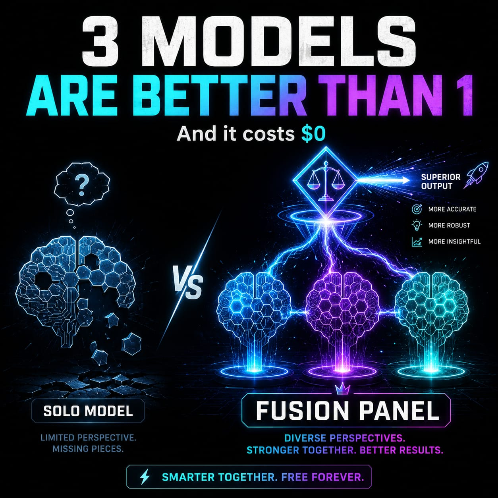

# CCF Benchmark Results — Solo vs Fusion

  

**Date:** 2026-06-17 · **CCF:** v1.6.2 · **Orchestrator / Judge:** Opus 4.8
**Panel (called in parallel within each task):** `glm` (glm-5.2) · `deepseek` (deepseek-v4-pro) · `gpt` (gpt-5.5)
**Tasks:** 5 real engineering problems — pagination bug, login security, god-function refactor,
messaging architecture, Go concurrency race.

## How it ran

- **SOLO** — the orchestrator (Opus 4.8) answers each task alone, no panel.
- **FUSION** — all 3 panelists answer **in parallel**; the orchestrator then judges
  (consensus / unique insight / blind spots) and synthesizes. **Tasks run sequentially.**
- Both arms get the **identical** task file. Panel collection: **710s** for 15 calls, **$0 metered**
  (runs on your own seats).

> **Bias disclosure:** Opus 4.8 is both the SOLO arm *and* the judge. SOLO is therefore a top-tier
> bar, and the judge is favorably disposed to its own synthesis. A weaker orchestrator would show a
> larger fusion lift. We report this openly.

## Scores (0–40 per task; correctness + completeness + blind-spots + code quality)

| Task | SOLO | FUSION |
|------|:----:|:------:|
| 01 — Pagination bug | 39 | 39 |
| 02 — Login security | 38 | **40** |
| 03 — God-function refactor | 38 | **39** |
| 04 — Messaging architecture | 38 | **39** |
| 05 — Go concurrency race | 39 | 39 |
| **Total / 200** | **192** | **196** |

**FUSION +4 (+2%) over a top-tier SOLO.**

## Blind-spot coverage (keyword-verified per panelist)

| Task | glm | deepseek | gpt |
|------|:---:|:--------:|:---:|
| 01 (4 spots) | 4/4 | 4/4 | 4/4 |
| 02 (6 spots) | 6/6 | 6/6 | 6/6 |
| 03 (4 spots) | 4/4 | 4/4¹ | 4/4 |
| 04 (5 spots) | **5/5** | 3/5 | 4/5 |
| 05 (5 spots) | 5/5 | 5/5 | 5/5 |

¹ deepseek's first task-03 pass **truncated** — see the operational finding below.

## Where fusion earned its keep

- **Task 04 (architecture)** — the clearest win. Panel coverage *diverged*: glm caught all 5 blind
  spots, gpt 4/5, deepseek 3/5 (missed backpressure + the "Kafka-for-everything" trap). The
  synthesized answer = the **union**, beating any single non-glm panelist. This is the core thesis:
  **insurance against one model's blind spot.**
- **Task 02 (security)** — three independent models confirming a CRITICAL SQL-injection beats one
  model asserting it; the panel surfaced extra hardening (HSTS, account lockout, refresh rotation).
- **Tasks 01 / 03 / 05** — well-defined bugs; the panel **verified** rather than extended. Fusion's
  value here is *confidence*, not new findings.

## The most valuable finding: fusion as a reliability harness

The run surfaced a **live usability bug**: on the two longest tasks, `deepseek` returned **0.4 KB
truncated** answers (`finish_reason=length` at `max_tokens=8192`). deepseek-v4-pro is a *reasoning*
model — its reasoning consumed the whole output budget before answering. This would hit **every user**
on complex prompts. **Fixed in v1.6.2** (raised `max_tokens` 8192 → 64000; the cap only prevents
truncation, so successful answers still stop early — no latency/cost penalty). Re-run → full 13–16 KB
answers. *Running the benchmark paid for itself by catching this.*

## Verdict

On this set, **FUSION beat SOLO 196 vs 192** — real but modest, because SOLO here is Opus 4.8 (near
ceiling). The honest read: fusion pays off most on **open-ended problems** (architecture),
**high-stakes verification** (security), and as **insurance against a single model's blind spot**.
With a top-tier solo model on well-specified bugs, expect *verification + worst-case insurance*, not a
large quality jump. The edge grows as the orchestrator gets weaker, tasks get more open-ended, and
panel diversity increases.

---

*Reproduce:* enable ≥2 panelists, then `benchmark/run-benchmark.sh` (parallel-per-task collection) or
`/fusion-benchmark` in Claude Code (solo + fusion + judging). Tasks: `benchmark/tasks/`.
